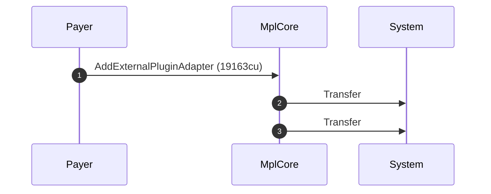
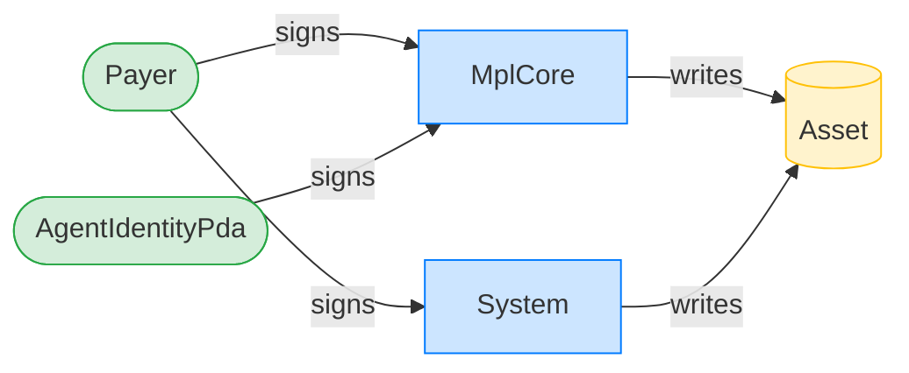
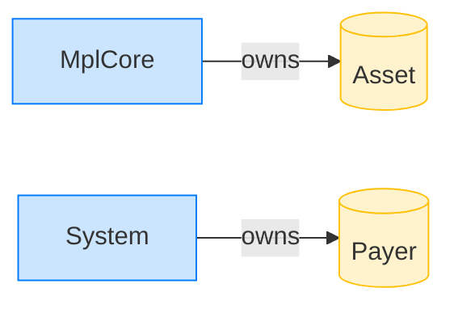

# Add an AgentIdentity plugin to an existing asset

**Intent.** Attach an AgentIdentity external plugin to an already-initialized asset. The PDA signs as a remaining account.

**Outcome.** The transaction succeeded.

**Source.** [`tests/agent_identity.rs::add_agent_identity_to_existing_asset`](../tests/agent_identity.rs#L281)

## Structured execution log

```
CPI Tree (19,163 BPF CU / 1,400,000 budget):
└── AddExternalPluginAdapter (19,163 / 1,400,000 CU) MplCore
    │ >> log:  programs/mpl-core/src/state/asset.rs:350:Approve
    ├── Transfer System
    └── Transfer System
```

## Sequence diagram



## Authority graph

Who signed for what; an `invoke_signed` PDA appears as its own authority.



## Ownership graph

Which program owns each account the transaction wrote.


