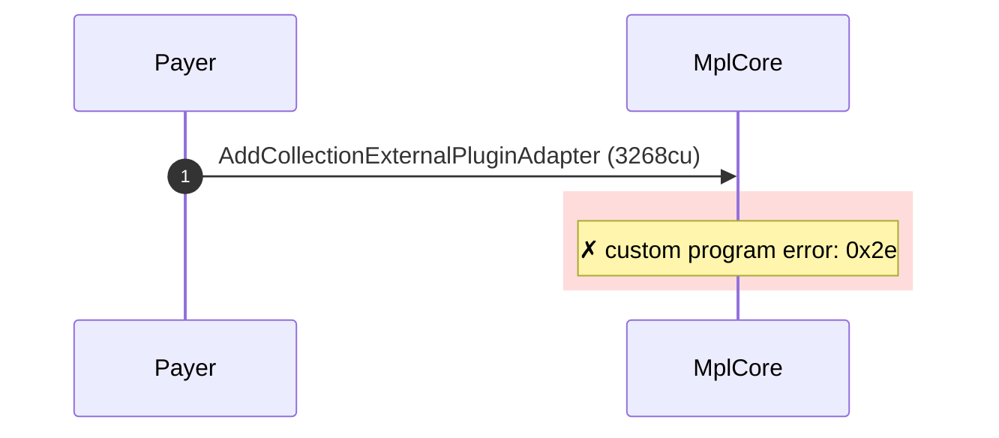
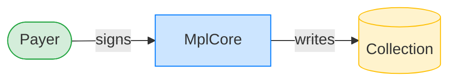
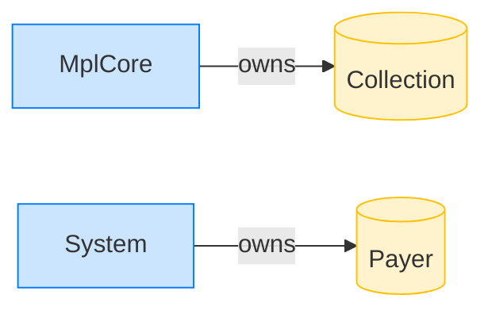

# Reject adding an AgentIdentity plugin to a collection

**Intent.** Attempt to add an AgentIdentity plugin to an existing collection. The plugin targets assets only; the add is rejected.

**Outcome.** The transaction failed: `custom program error: 0x2e`.

**Source.** [`tests/agent_identity.rs::cannot_add_agent_identity_to_collection`](../tests/agent_identity.rs#L500)

## Structured execution log

```
CPI Tree (3,268 BPF CU / 1,400,000 budget):
└── AddCollectionExternalPluginAdapter FAILED: custom program error: 0x2e (3,268 / 1,400,000 CU) MplCore (no CPIs)
      >> log:  Error: Custom program error: 0x2e
```

## Sequence diagram



## Authority graph

Who signed for what; an `invoke_signed` PDA appears as its own authority.



## Ownership graph

Which program owns each account the transaction wrote.


