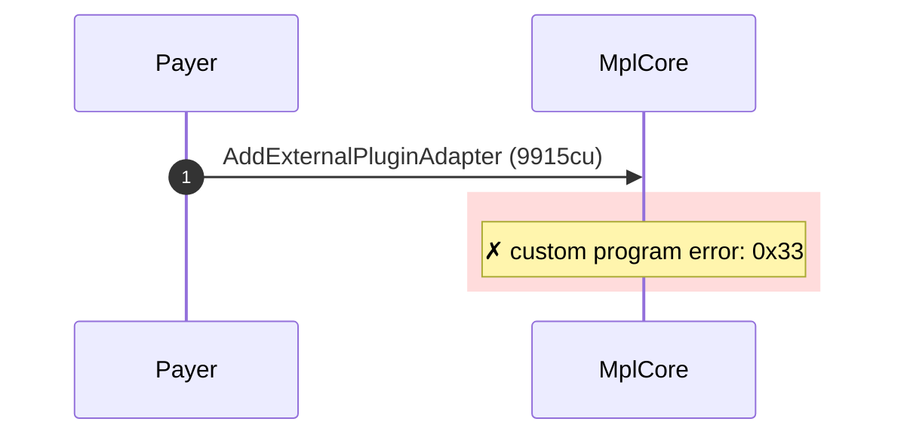
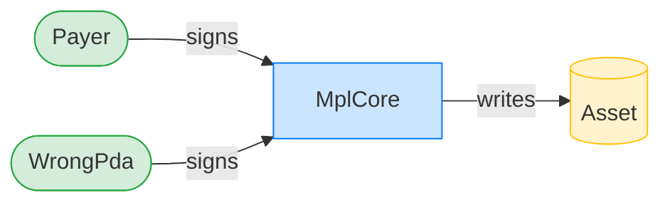
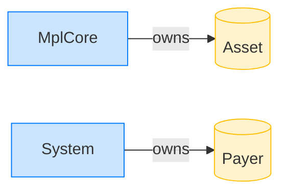

# Reject a mismatched AgentIdentity PDA

**Intent.** Attempt to add an AgentIdentity plugin signed by a PDA derived from a different asset. The derivation check rejects the wrong PDA.

**Outcome.** The transaction failed: `custom program error: 0x33`.

**Source.** [`tests/agent_identity.rs::cannot_add_agent_identity_with_wrong_pda`](../tests/agent_identity.rs#L569)

## Structured execution log

```
CPI Tree (9,915 BPF CU / 1,400,000 budget):
└── AddExternalPluginAdapter FAILED: custom program error: 0x33 (9,915 / 1,400,000 CU) MplCore (no CPIs)
      >> log:  Error: Custom program error: 0x33
```

## Sequence diagram



## Authority graph

Who signed for what; an `invoke_signed` PDA appears as its own authority.



## Ownership graph

Which program owns each account the transaction wrote.


