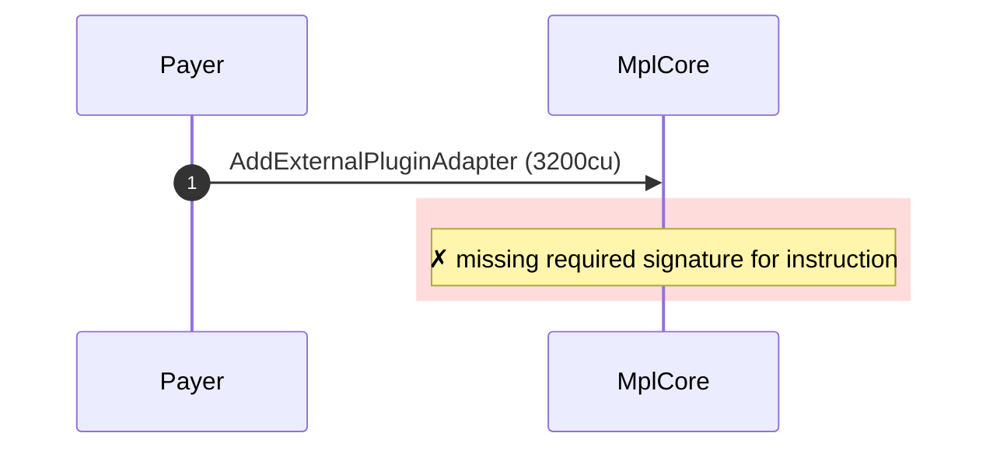
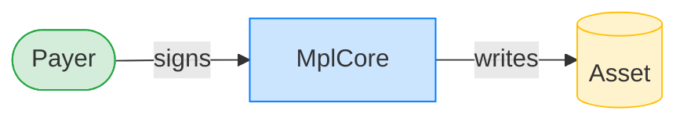
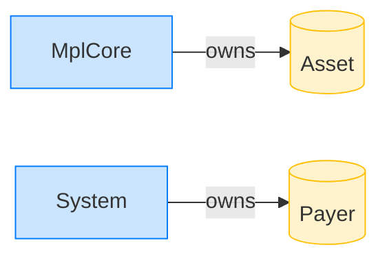

# Reject adding an AgentIdentity plugin without the PDA

**Intent.** Attempt to add an AgentIdentity plugin with the signing PDA remaining account omitted; the program cannot find a signer and rejects.

**Outcome.** The transaction failed: `missing required signature for instruction`.

**Source.** [`tests/agent_identity.rs::cannot_add_agent_identity_without_pda_remaining_account`](../tests/agent_identity.rs#L536)

## Structured execution log

```
CPI Tree (3,200 BPF CU / 1,400,000 budget):
└── AddExternalPluginAdapter FAILED: missing required signature for instruction (3,200 / 1,400,000 CU) MplCore (no CPIs)
      >> log:  Error: A signature was required but not found
```

## Sequence diagram



## Authority graph

Who signed for what; an `invoke_signed` PDA appears as its own authority.



## Ownership graph

Which program owns each account the transaction wrote.


