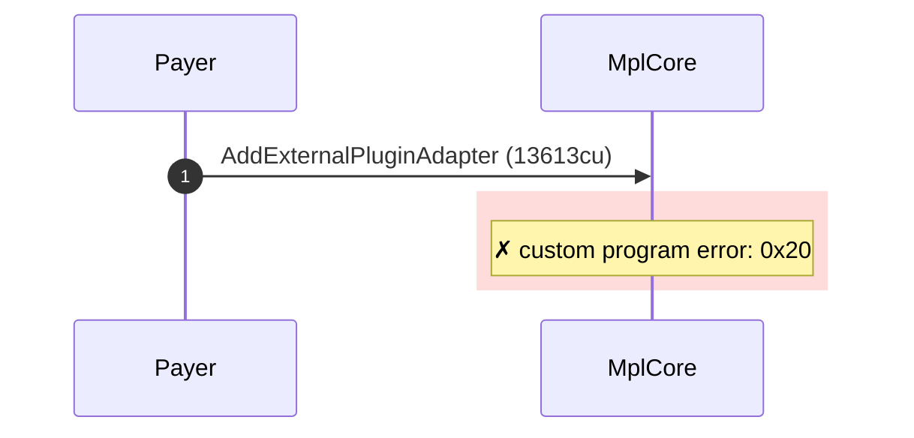
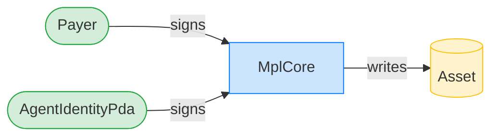
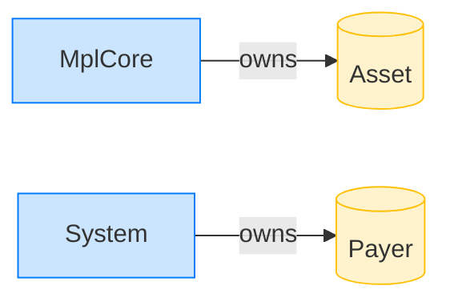

# Reject a duplicate AgentIdentity plugin

**Intent.** Attempt to add a second AgentIdentity plugin to an asset that already carries one; the program rejects the duplicate.

**Outcome.** The transaction failed: `custom program error: 0x20`.

**Source.** [`tests/agent_identity.rs::cannot_add_duplicate_agent_identity`](../tests/agent_identity.rs#L629)

## Structured execution log

```
CPI Tree (13,613 BPF CU / 1,400,000 budget):
└── AddExternalPluginAdapter FAILED: custom program error: 0x20 (13,613 / 1,400,000 CU) MplCore (no CPIs)
      >> log:  programs/mpl-core/src/state/asset.rs:350:Approve
      >> log:  Error: Custom program error: 0x20
```

## Sequence diagram



## Authority graph

Who signed for what; an `invoke_signed` PDA appears as its own authority.



## Ownership graph

Which program owns each account the transaction wrote.


