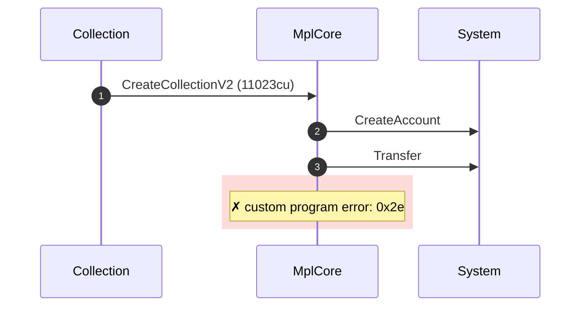
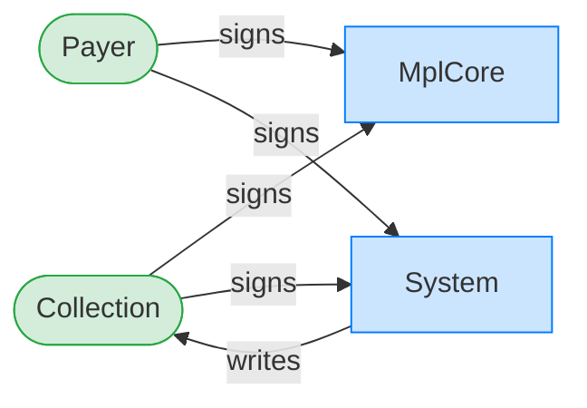
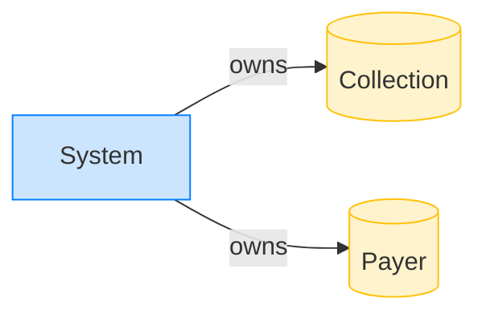

# Reject an AgentIdentity plugin on a created collection

**Intent.** Attempt to create a collection with an AgentIdentity plugin. AgentIdentity targets assets only; the program rejects the collection target.

**Outcome.** The transaction failed: `custom program error: 0x2e`.

**Source.** [`tests/agent_identity.rs::cannot_create_collection_with_agent_identity`](../tests/agent_identity.rs#L481)

## Structured execution log

```
CPI Tree (11,023 BPF CU / 1,400,000 budget):
└── CreateCollectionV2 FAILED: custom program error: 0x2e (11,023 / 1,400,000 CU) MplCore
    │ >> log:  Error: Custom program error: 0x2e
    ├── CreateAccount System
    └── Transfer System
```

## Sequence diagram



## Authority graph

Who signed for what; an `invoke_signed` PDA appears as its own authority.



## Ownership graph

Which program owns each account the transaction wrote.


