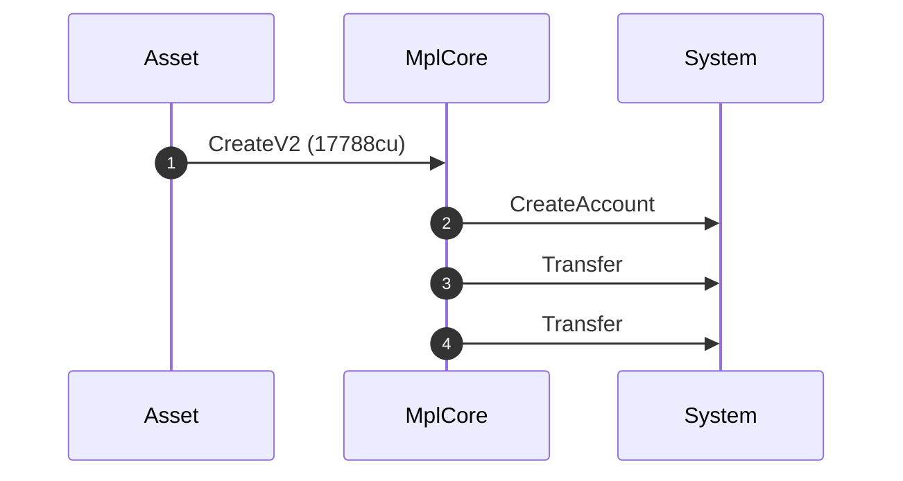
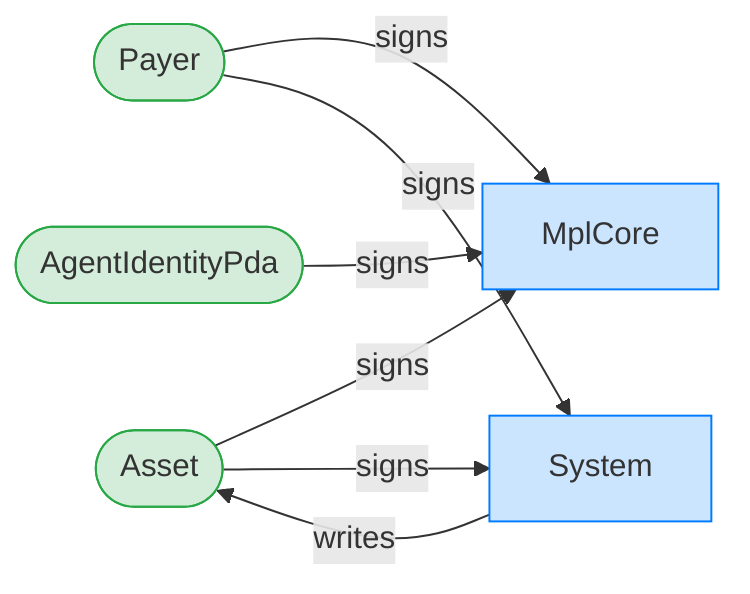
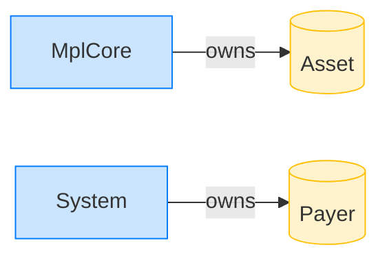

# Create an asset with multiple lifecycle checks

**Intent.** Allocate an asset whose AgentIdentity plugin registers a wider lifecycle check (CAN_LISTEN | CAN_APPROVE) at creation time.

**Outcome.** The transaction succeeded.

**Source.** [`tests/agent_identity.rs::create_asset_with_agent_identity_multiple_lifecycle_checks`](../tests/agent_identity.rs#L426)

## Structured execution log

```
CPI Tree (17,788 BPF CU / 1,400,000 budget):
└── CreateV2 (17,788 / 1,400,000 CU) MplCore
    │ >> log:  programs/mpl-core/src/state/asset.rs:155:Approve
    ├── CreateAccount System
    ├── Transfer System
    └── Transfer System
```

## Sequence diagram



## Authority graph

Who signed for what; an `invoke_signed` PDA appears as its own authority.



## Ownership graph

Which program owns each account the transaction wrote.


