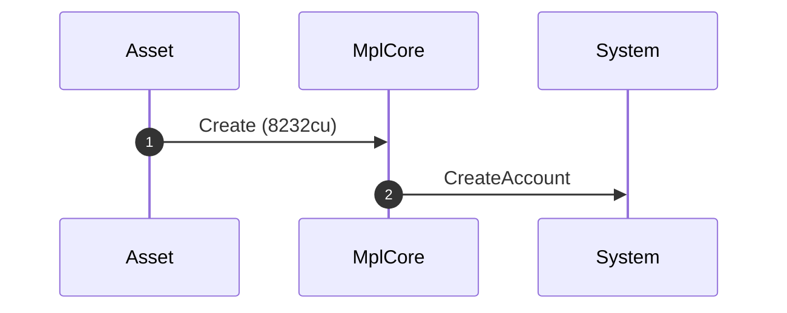
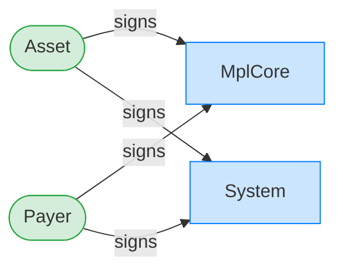
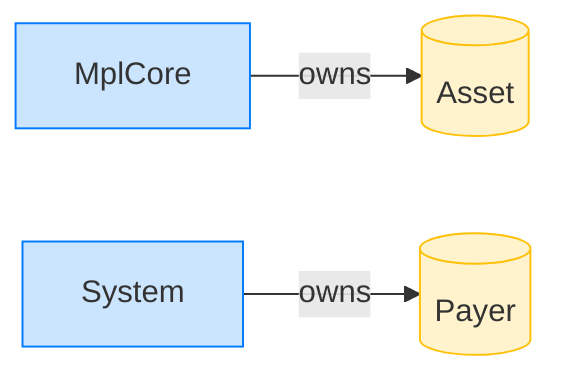

# Create an asset

**Intent.** Allocate a fresh asset; the program creates the account through a System CPI.

**Outcome.** The transaction succeeded.

**Source.** [`tests/report.rs::create`](../tests/report.rs#L16)

## Structured execution log

```
CPI Tree (8,232 BPF CU / 1,400,000 budget):
└── Create (8,232 / 1,400,000 CU) MplCore
    │ >> log:  programs/mpl-core/src/state/asset.rs:155:Approve
    └── CreateAccount System
```

## Sequence diagram



## Authority graph

Who signed for what; an `invoke_signed` PDA appears as its own authority.



## Ownership graph

Which program owns each account the transaction wrote.


