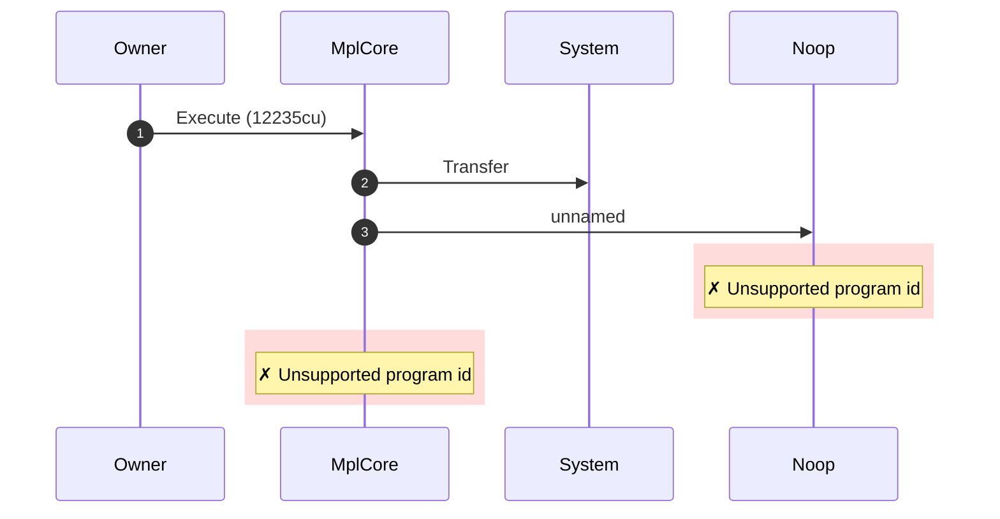
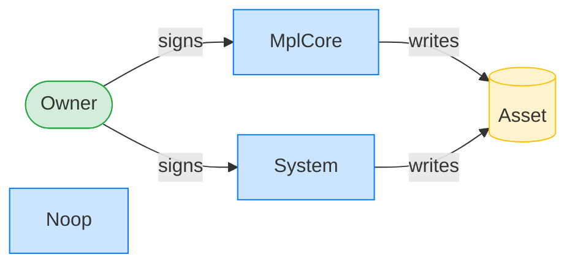
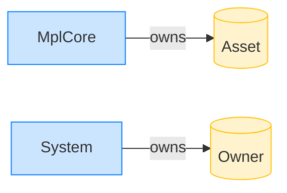

# Execute as owner

**Intent.** The asset owner invokes ExecuteV1. The AgentIdentity plugin approves on owner authority; the CPI to the (unloaded) Noop program then fails, so the run reaches the CPI frame but does not complete it.

**Outcome.** The transaction failed: `Unsupported program id`.

**Source.** [`tests/execution_delegate.rs::execute_as_owner`](../tests/execution_delegate.rs#L146)

## Structured execution log

```
CPI Tree (12,235 BPF CU / 1,400,000 budget):
└── Execute FAILED: Unsupported program id (12,235 / 1,400,000 CU) MplCore
    │ >> log:  programs/mpl-core/src/state/asset.rs:335:Approve
    ├── Transfer System
    └── FAILED: Unsupported program id Noop
          >> log:  Program is not cached
```

## Sequence diagram



## Authority graph

Who signed for what; an `invoke_signed` PDA appears as its own authority.



## Ownership graph

Which program owns each account the transaction wrote.


