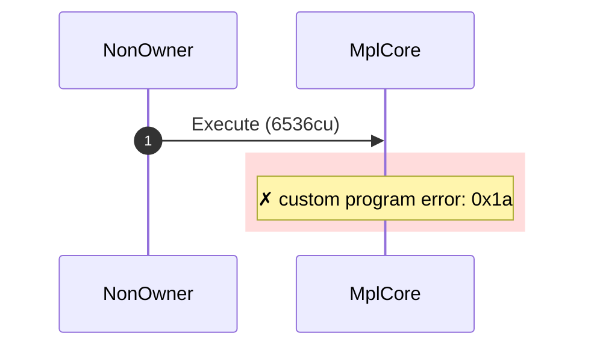
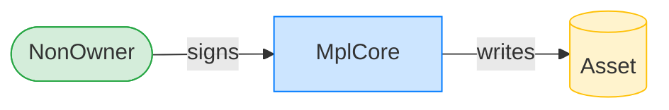
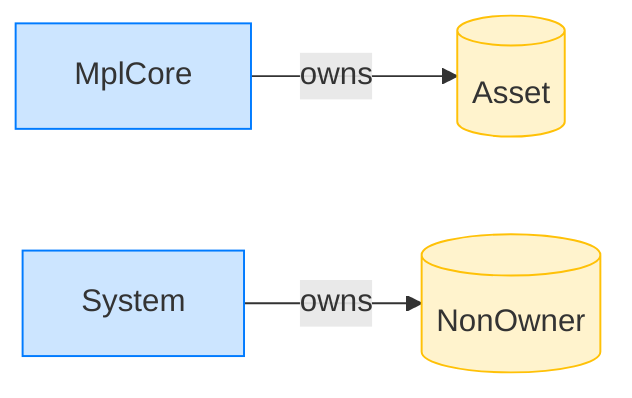

# Reject a non-owner on an asset with no AgentIdentity plugin

**Intent.** The asset carries no AgentIdentity plugin, so there is nothing to approve a non-owner: NoApprovals.

**Outcome.** The transaction failed: `custom program error: 0x1a`.

**Source.** [`tests/execution_delegate.rs::execute_non_owner_without_agent_identity_plugin`](../tests/execution_delegate.rs#L360)

## Structured execution log

```
CPI Tree (6,536 BPF CU / 1,400,000 budget):
└── Execute FAILED: custom program error: 0x1a (6,536 / 1,400,000 CU) MplCore (no CPIs)
      >> log:  Error: Custom program error: 0x1a
```

## Sequence diagram



## Authority graph

Who signed for what; an `invoke_signed` PDA appears as its own authority.



## Ownership graph

Which program owns each account the transaction wrote.


