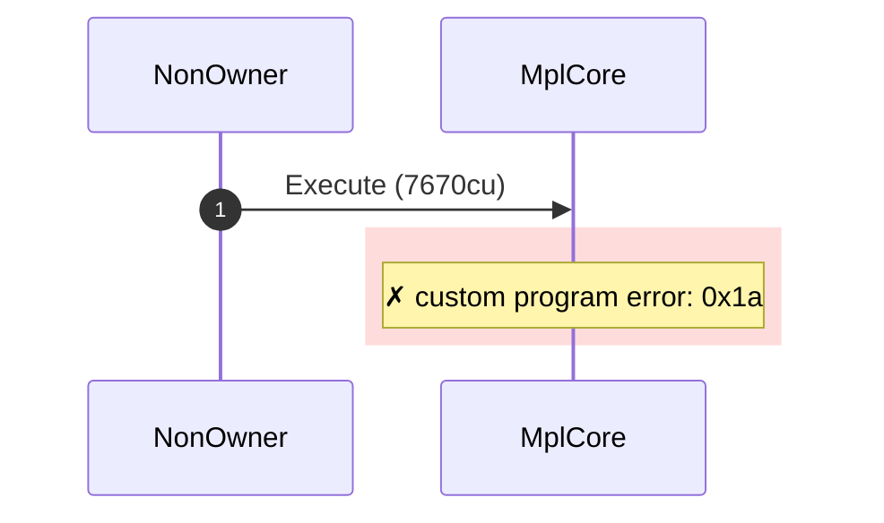
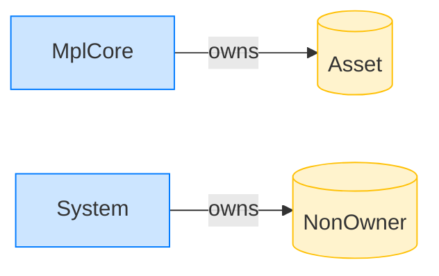

# Reject a non-owner with no delegate record

**Intent.** A non-owner authority with no remaining accounts: the plugin abstains and the transaction fails with NoApprovals.

**Outcome.** The transaction failed: `custom program error: 0x1a`.

**Source.** [`tests/execution_delegate.rs::execute_non_owner_without_remaining_accounts`](../tests/execution_delegate.rs#L283)

## Structured execution log

```
CPI Tree (7,670 BPF CU / 1,400,000 budget):
└── Execute FAILED: custom program error: 0x1a (7,670 / 1,400,000 CU) MplCore (no CPIs)
      >> log:  Error: Custom program error: 0x1a
```

## Sequence diagram



## Authority graph

Who signed for what; an `invoke_signed` PDA appears as its own authority.


## Ownership graph

Which program owns each account the transaction wrote.


