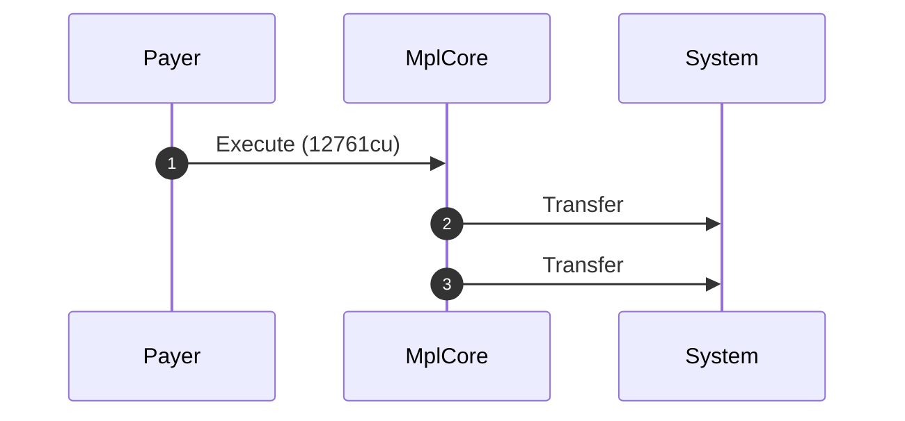
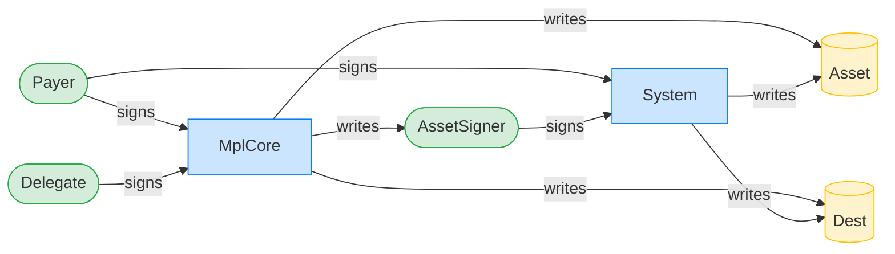
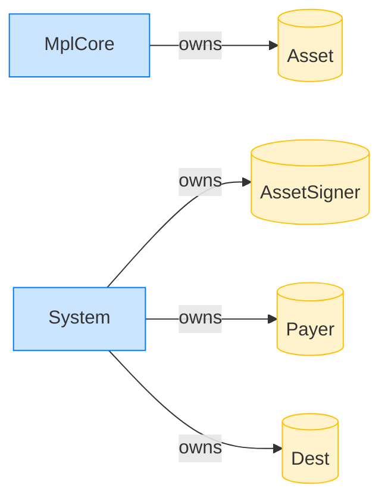

# Delegate (separate authority) executes a System transfer

**Intent.** As above, but the payer and the delegate authority are distinct signers.

**Outcome.** The transaction succeeded.

**Source.** [`tests/execution_delegate.rs::execute_system_transfer_delegate_separate_authority`](../tests/execution_delegate.rs#L686)

## Structured execution log

```
CPI Tree (12,761 BPF CU / 1,400,000 budget):
└── Execute (12,761 / 1,400,000 CU) MplCore
    │ >> log:  programs/mpl-core/src/plugins/external/agent_identity.rs:67:Approve
    │ >> log:  programs/mpl-core/src/plugins/lifecycle.rs:822:Approve
    ├── Transfer System
    └── Transfer System
```

## Sequence diagram



## Authority graph

Who signed for what; an `invoke_signed` PDA appears as its own authority.



## Ownership graph

Which program owns each account the transaction wrote.


