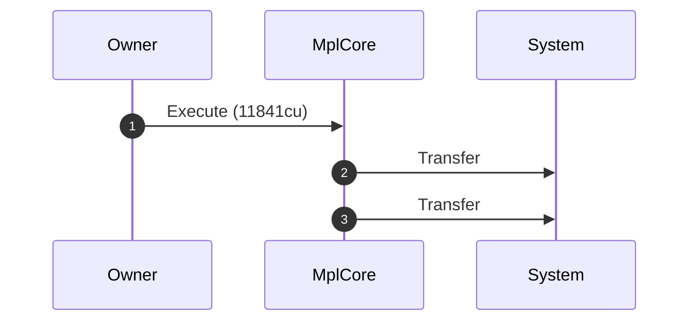
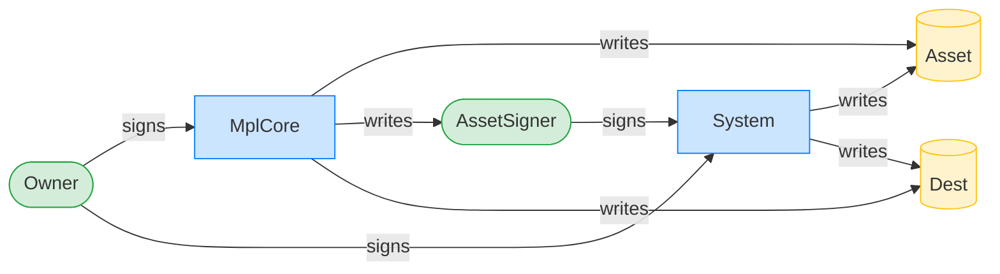
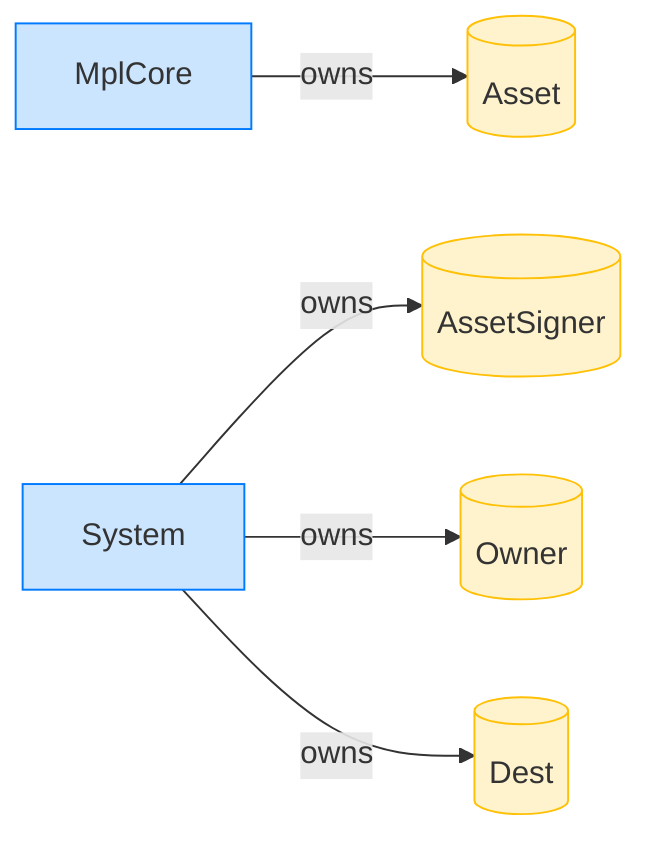

# Owner CPI passes non-delegate remaining accounts through

**Intent.** With no delegate record, every remaining account flows straight to the CPI: the System transfer's source and destination.

**Outcome.** The transaction succeeded.

**Source.** [`tests/execution_delegate.rs::execute_system_transfer_non_delegate_remaining_account_preserved`](../tests/execution_delegate.rs#L742)

## Structured execution log

```
CPI Tree (11,841 BPF CU / 1,400,000 budget):
└── Execute (11,841 / 1,400,000 CU) MplCore
    │ >> log:  programs/mpl-core/src/state/asset.rs:335:Approve
    ├── Transfer System
    └── Transfer System
```

## Sequence diagram



## Authority graph

Who signed for what; an `invoke_signed` PDA appears as its own authority.



## Ownership graph

Which program owns each account the transaction wrote.


