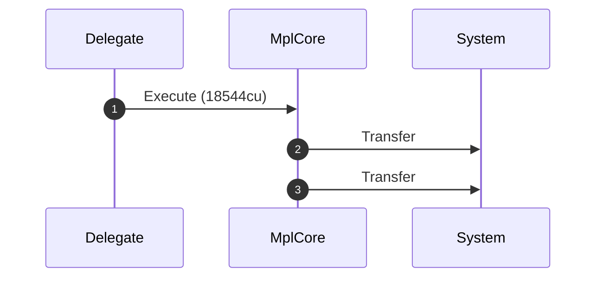
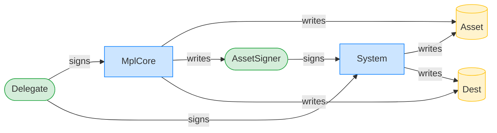
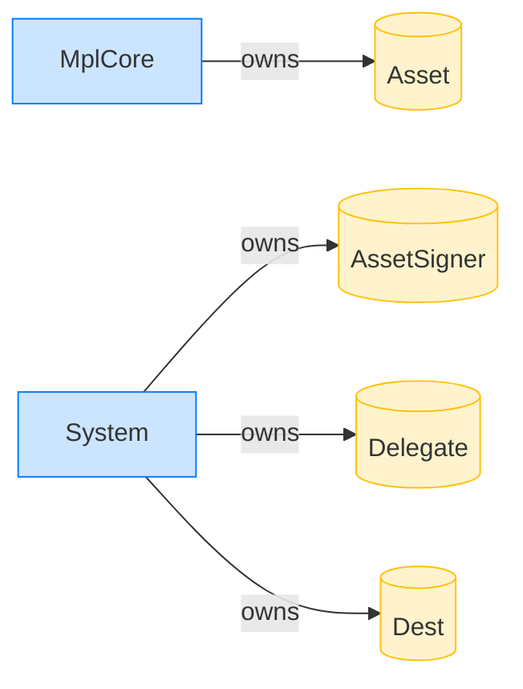

# Delegate executes a System transfer (record stripped)

**Intent.** A delegate drives a System transfer; the delegate record at the head of the remaining accounts is stripped before the CPI so the System program sees only source and destination.

**Outcome.** The transaction succeeded.

**Source.** [`tests/execution_delegate.rs::execute_system_transfer_with_delegate_record_stripped`](../tests/execution_delegate.rs#L632)

## Structured execution log

```
CPI Tree (18,544 BPF CU / 1,400,000 budget):
└── Execute (18,544 / 1,400,000 CU) MplCore
    │ >> log:  programs/mpl-core/src/plugins/external/agent_identity.rs:67:Approve
    │ >> log:  programs/mpl-core/src/plugins/lifecycle.rs:822:Approve
    ├── Transfer System
    └── Transfer System
```

## Sequence diagram



## Authority graph

Who signed for what; an `invoke_signed` PDA appears as its own authority.



## Ownership graph

Which program owns each account the transaction wrote.


