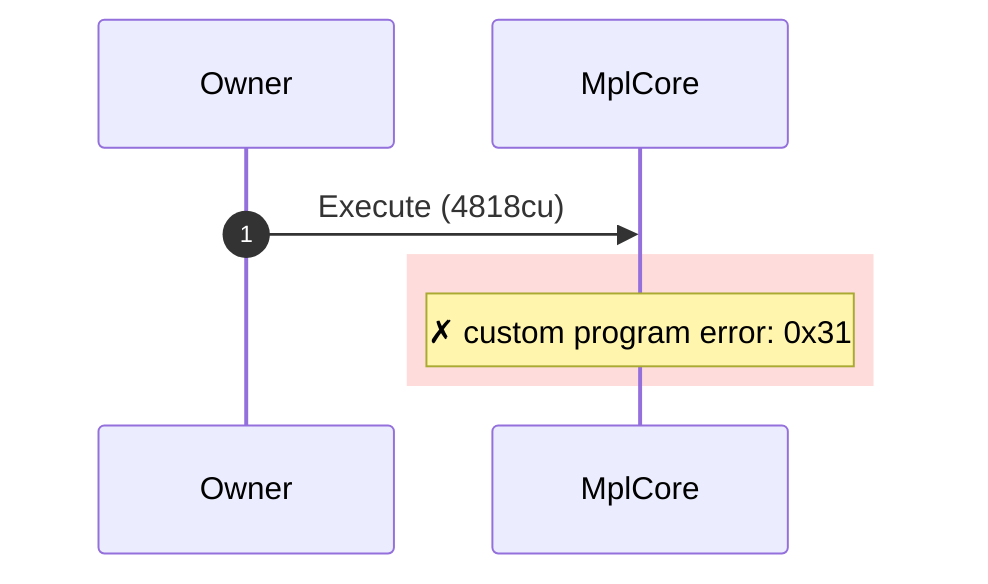
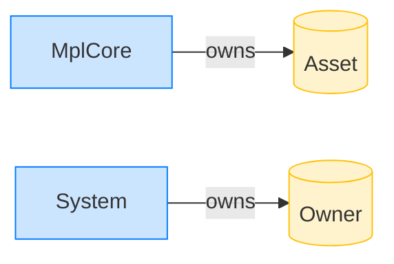

# Reject a wrong asset_signer PDA

**Intent.** The asset_signer account is not the program-derived address, so the program rejects with InvalidExecutePda.

**Outcome.** The transaction failed: `custom program error: 0x31`.

**Source.** [`tests/execution_delegate.rs::execute_with_invalid_asset_signer_pda`](../tests/execution_delegate.rs#L322)

## Structured execution log

```
CPI Tree (4,818 BPF CU / 1,400,000 budget):
└── Execute FAILED: custom program error: 0x31 (4,818 / 1,400,000 CU) MplCore (no CPIs)
      >> log:  Error: Custom program error: 0x31
```

## Sequence diagram



## Authority graph

Who signed for what; an `invoke_signed` PDA appears as its own authority.


## Ownership graph

Which program owns each account the transaction wrote.


