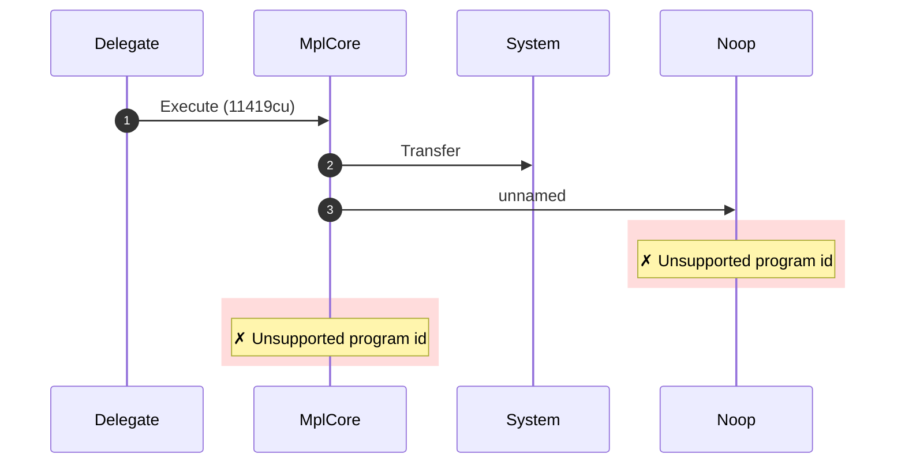
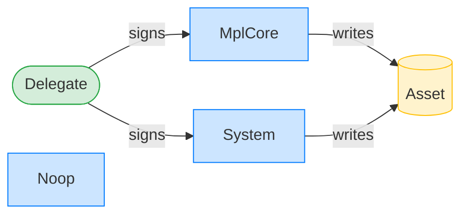
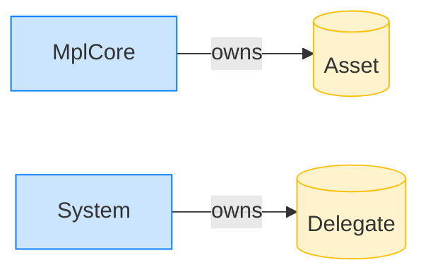

# Execute via a valid delegate record

**Intent.** A non-owner authority presents an ExecutionDelegateRecordV1 whose authority and agent_asset match. The plugin approves; the Noop CPI fails as above.

**Outcome.** The transaction failed: `Unsupported program id`.

**Source.** [`tests/execution_delegate.rs::execute_with_valid_delegate_record`](../tests/execution_delegate.rs#L188)

## Structured execution log

```
CPI Tree (11,419 BPF CU / 1,400,000 budget):
└── Execute FAILED: Unsupported program id (11,419 / 1,400,000 CU) MplCore
    │ >> log:  programs/mpl-core/src/plugins/external/agent_identity.rs:67:Approve
    │ >> log:  programs/mpl-core/src/plugins/lifecycle.rs:822:Approve
    ├── Transfer System
    └── FAILED: Unsupported program id Noop
          >> log:  Program is not cached
```

## Sequence diagram



## Authority graph

Who signed for what; an `invoke_signed` PDA appears as its own authority.



## Ownership graph

Which program owns each account the transaction wrote.


