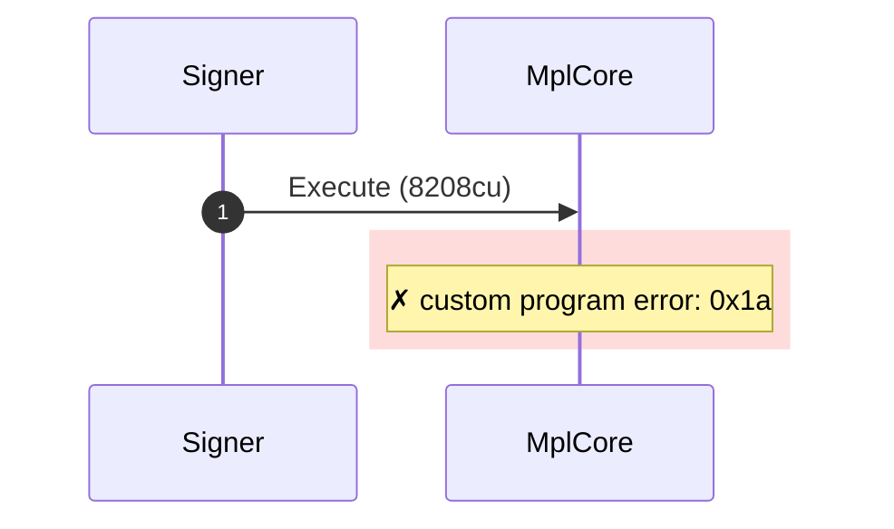
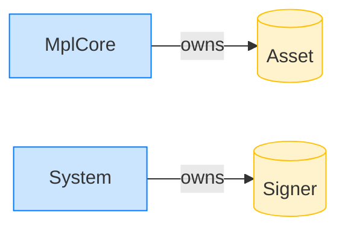

# Reject a delegate record with the wrong authority

**Intent.** The record's authority does not match the signer, so the plugin abstains: NoApprovals.

**Outcome.** The transaction failed: `custom program error: 0x1a`.

**Source.** [`tests/execution_delegate.rs::execute_with_wrong_authority_delegate`](../tests/execution_delegate.rs#L398)

## Structured execution log

```
CPI Tree (8,208 BPF CU / 1,400,000 budget):
└── Execute FAILED: custom program error: 0x1a (8,208 / 1,400,000 CU) MplCore (no CPIs)
      >> log:  Error: Custom program error: 0x1a
```

## Sequence diagram



## Authority graph

Who signed for what; an `invoke_signed` PDA appears as its own authority.


## Ownership graph

Which program owns each account the transaction wrote.


