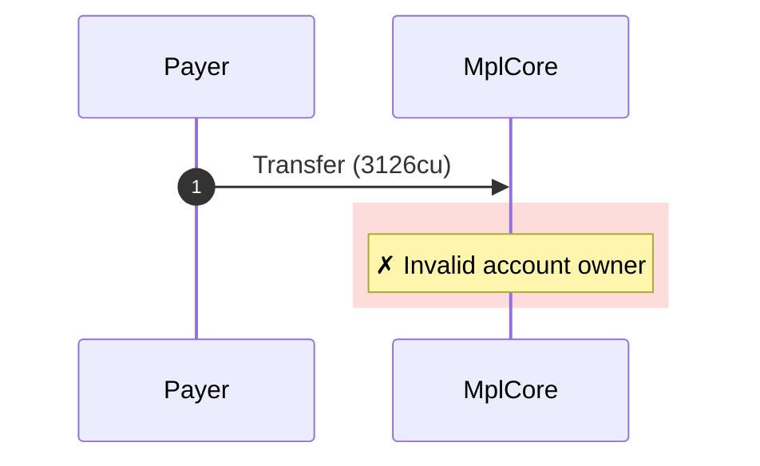
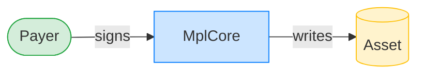
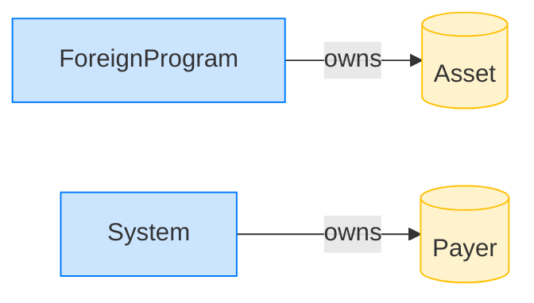

# Reject a foreign-owned asset

**Intent.** Transfer an account that carries valid AssetV1 bytes but is owned by another program.

**Outcome.** The transaction failed: `Invalid account owner`.

**Source.** [`tests/report.rs::reject_foreign_owned`](../tests/report.rs#L40)

## Structured execution log

```
CPI Tree (3,126 BPF CU / 1,400,000 budget):
└── Transfer FAILED: Invalid account owner (3,126 / 1,400,000 CU) MplCore (no CPIs)
      >> log:  Error: Invalid account owner
```

## Sequence diagram



## Authority graph

Who signed for what; an `invoke_signed` PDA appears as its own authority.



## Ownership graph

Which program owns each account the transaction wrote.


