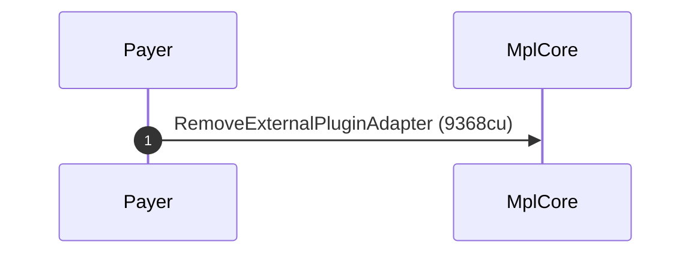
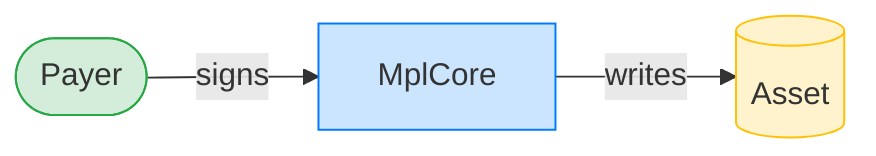
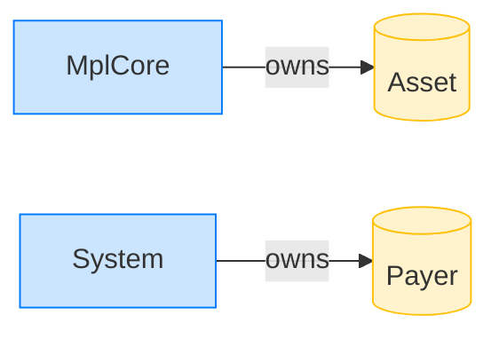

# Remove an AgentIdentity plugin

**Intent.** Strip the AgentIdentity external plugin from an asset that carries it.

**Outcome.** The transaction succeeded.

**Source.** [`tests/agent_identity.rs::remove_agent_identity`](../tests/agent_identity.rs#L402)

## Structured execution log

```
CPI Tree (9,368 BPF CU / 1,400,000 budget):
└── RemoveExternalPluginAdapter (9,368 / 1,400,000 CU) MplCore (no CPIs)
      >> log:  programs/mpl-core/src/state/asset.rs:364:Approve
```

## Sequence diagram



## Authority graph

Who signed for what; an `invoke_signed` PDA appears as its own authority.



## Ownership graph

Which program owns each account the transaction wrote.


