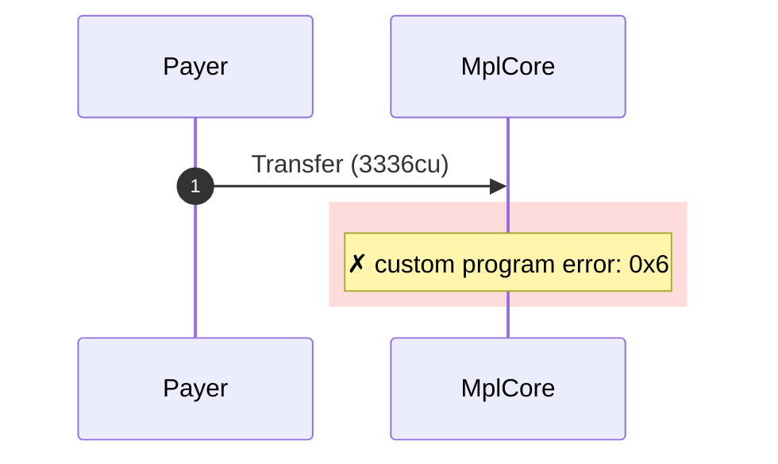
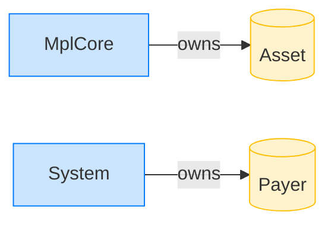

# Transfer rejects the wrong discriminator

**Intent.** An mpl-core-owned account carries CollectionV1 (disc 5) bytes where AssetV1 (disc 1) is expected; transfer rejects it.

**Outcome.** The transaction failed: `custom program error: 0x6`.

**Source.** [`tests/account_ownership.rs::transfer_rejects_account_with_wrong_discriminator`](../tests/account_ownership.rs#L204)

## Structured execution log

```
CPI Tree (3,336 BPF CU / 1,400,000 budget):
└── Transfer FAILED: custom program error: 0x6 (3,336 / 1,400,000 CU) MplCore (no CPIs)
      >> log:  Error: Custom program error: 0x6
```

## Sequence diagram



## Authority graph

Who signed for what; an `invoke_signed` PDA appears as its own authority.


## Ownership graph

Which program owns each account the transaction wrote.


