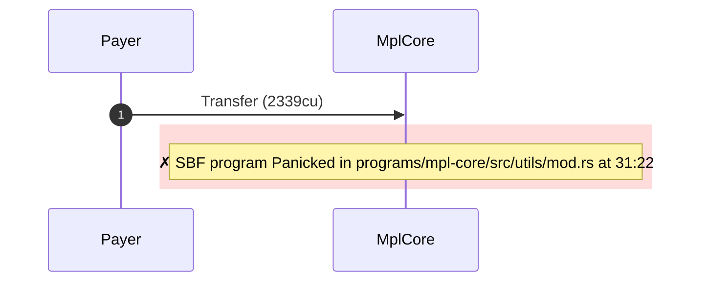
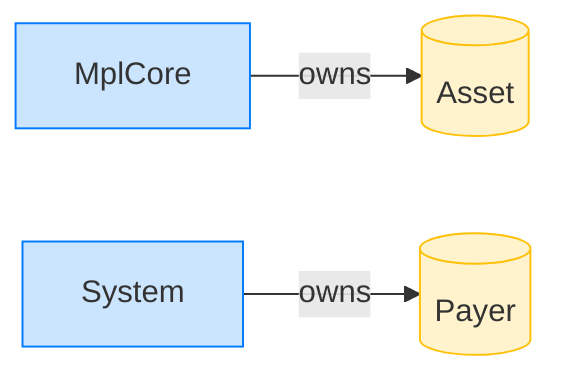

# Transfer rejects an empty account

**Intent.** An mpl-core-owned account with no data is presented to transfer; it fails immediately.

**Outcome.** The transaction failed: `Program failed to complete`.

**Source.** [`tests/account_ownership.rs::transfer_rejects_empty_account`](../tests/account_ownership.rs#L289)

## Structured execution log

```
CPI Tree (2,339 BPF CU / 1,400,000 budget):
└── Transfer FAILED: SBF program Panicked in programs/mpl-core/src/utils/mod.rs at 31:22 (2,339 / 1,400,000 CU) MplCore (no CPIs)
```

## Sequence diagram



## Authority graph

Who signed for what; an `invoke_signed` PDA appears as its own authority.


## Ownership graph

Which program owns each account the transaction wrote.


