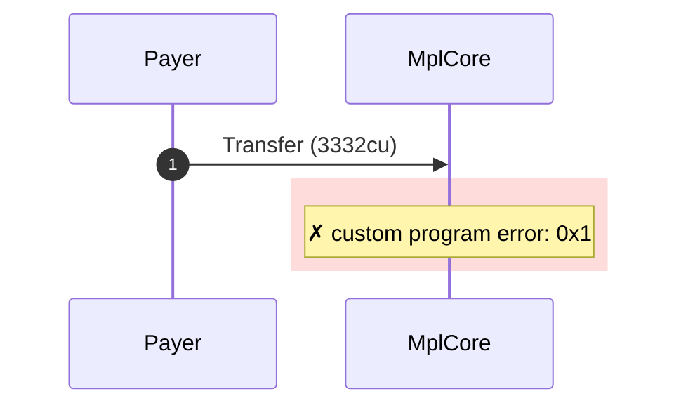
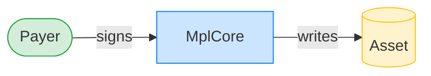
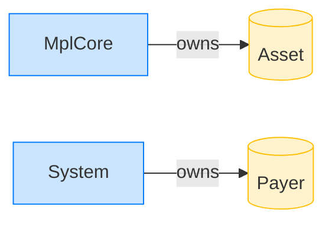

# Transfer rejects garbage data

**Intent.** An mpl-core-owned account is filled with 0xFF; transfer fails at deserialization.

**Outcome.** The transaction failed: `custom program error: 0x1`.

**Source.** [`tests/account_ownership.rs::transfer_rejects_random_data_account`](../tests/account_ownership.rs#L262)

## Structured execution log

```
CPI Tree (3,332 BPF CU / 1,400,000 budget):
└── Transfer FAILED: custom program error: 0x1 (3,332 / 1,400,000 CU) MplCore (no CPIs)
      >> log:  Error: Custom program error: 0x1
```

## Sequence diagram



## Authority graph

Who signed for what; an `invoke_signed` PDA appears as its own authority.



## Ownership graph

Which program owns each account the transaction wrote.


