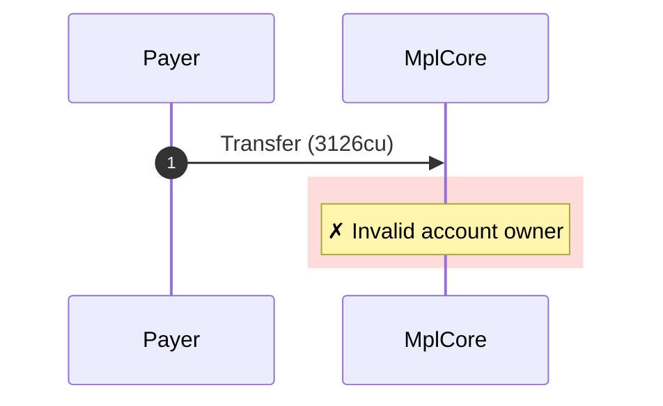
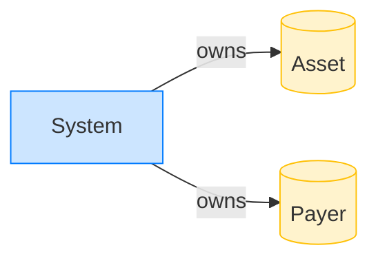

# Transfer rejects a system-owned account with an asset discriminator

**Intent.** A System-owned account carries valid AssetV1 bytes; transfer rejects it on the owner check.

**Outcome.** The transaction failed: `Invalid account owner`.

**Source.** [`tests/account_ownership.rs::transfer_rejects_system_owned_account_with_asset_discriminator`](../tests/account_ownership.rs#L336)

## Structured execution log

```
CPI Tree (3,126 BPF CU / 1,400,000 budget):
└── Transfer FAILED: Invalid account owner (3,126 / 1,400,000 CU) MplCore (no CPIs)
      >> log:  Error: Invalid account owner
```

## Sequence diagram



## Authority graph

Who signed for what; an `invoke_signed` PDA appears as its own authority.


## Ownership graph

Which program owns each account the transaction wrote.


