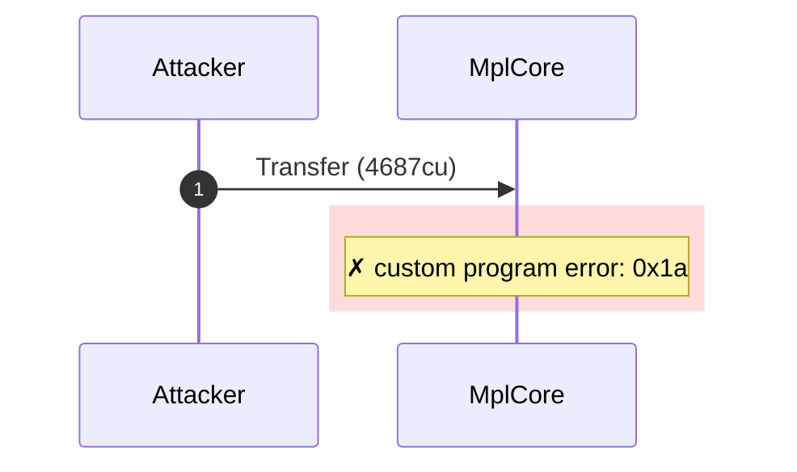
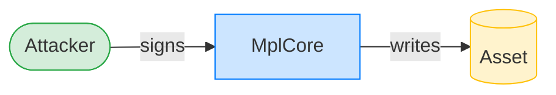
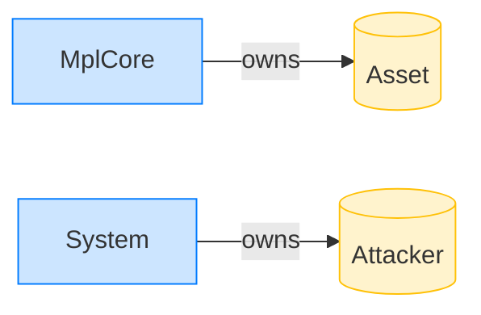

# Transfer rejects an unauthorized caller

**Intent.** A valid asset is owned by someone else; an attacker signs the transfer and is rejected on the authority check.

**Outcome.** The transaction failed: `custom program error: 0x1a`.

**Source.** [`tests/account_ownership.rs::transfer_rejects_unauthorized_caller_on_valid_asset`](../tests/account_ownership.rs#L369)

## Structured execution log

```
CPI Tree (4,687 BPF CU / 1,400,000 budget):
└── Transfer FAILED: custom program error: 0x1a (4,687 / 1,400,000 CU) MplCore (no CPIs)
      >> log:  Error: Custom program error: 0x1a
```

## Sequence diagram



## Authority graph

Who signed for what; an `invoke_signed` PDA appears as its own authority.



## Ownership graph

Which program owns each account the transaction wrote.


