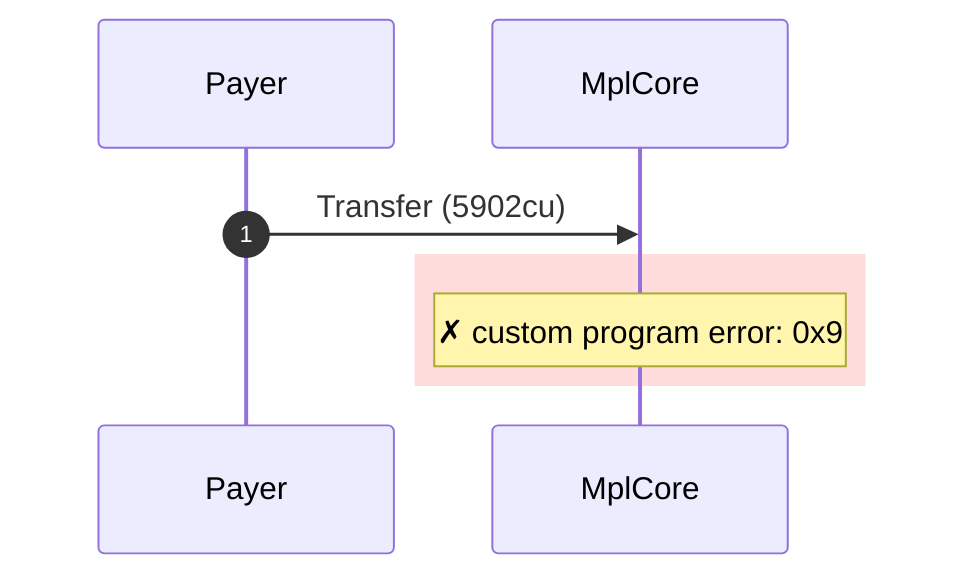
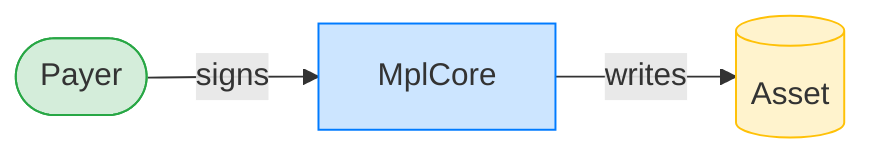
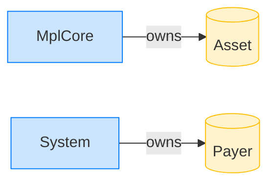

# Transfer rejects a valid frozen asset

**Intent.** A valid mpl-core-owned asset with FreezeDelegate{frozen:true}; the freeze plugin rejects the transfer.

**Outcome.** The transaction failed: `custom program error: 0x9`.

**Source.** [`tests/account_ownership.rs::transfer_rejects_valid_frozen_asset`](../tests/account_ownership.rs#L735)

## Structured execution log

```
CPI Tree (5,902 BPF CU / 1,400,000 budget):
└── Transfer FAILED: custom program error: 0x9 (5,902 / 1,400,000 CU) MplCore (no CPIs)
      >> log:  programs/mpl-core/src/state/asset.rs:293:Approve
      >> log:  programs/mpl-core/src/plugins/internal/owner_managed/freeze_delegate.rs:59:Reject
      >> log:  programs/mpl-core/src/plugins/lifecycle.rs:739:Reject
      >> log:  Error: Custom program error: 0x9
```

## Sequence diagram



## Authority graph

Who signed for what; an `invoke_signed` PDA appears as its own authority.



## Ownership graph

Which program owns each account the transaction wrote.


