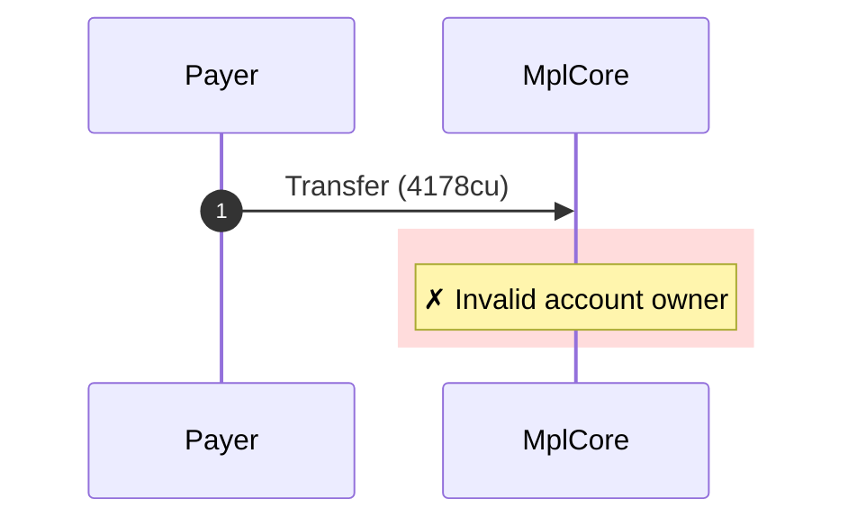
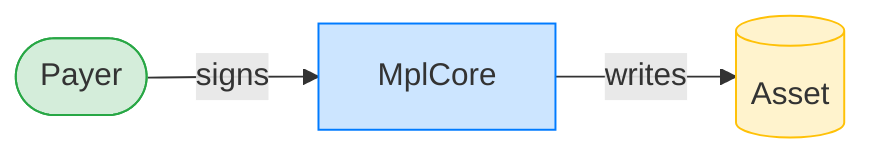
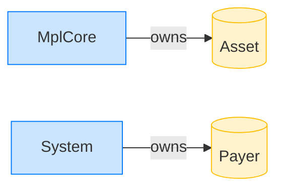

# Transfer rejects when a referenced collection is foreign-owned (permanent transfer)

**Intent.** A valid asset references a foreign-owned collection carrying a PermanentTransferDelegate; the collection's owner check rejects the transfer.

**Outcome.** The transaction failed: `Invalid account owner`.

**Source.** [`tests/account_ownership.rs::transfer_rejects_when_fake_collection_has_permanent_transfer_delegate`](../tests/account_ownership.rs#L683)

## Structured execution log

```
CPI Tree (4,178 BPF CU / 1,400,000 budget):
└── Transfer FAILED: Invalid account owner (4,178 / 1,400,000 CU) MplCore (no CPIs)
      >> log:  Error: Invalid account owner
```

## Sequence diagram



## Authority graph

Who signed for what; an `invoke_signed` PDA appears as its own authority.



## Ownership graph

Which program owns each account the transaction wrote.


