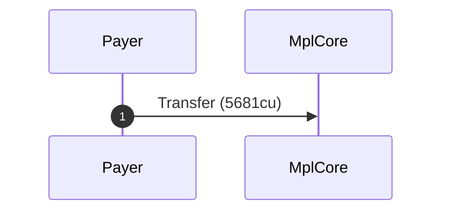
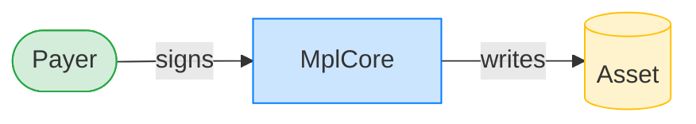
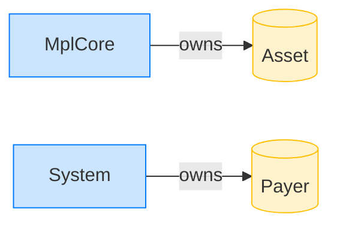

# Transfer succeeds on a valid unfrozen asset with a freeze plugin

**Intent.** A valid mpl-core-owned asset with FreezeDelegate{frozen:false}; the owner's transfer succeeds.

**Outcome.** The transaction succeeded.

**Source.** [`tests/account_ownership.rs::transfer_succeeds_valid_unfrozen_asset_with_freeze_plugin`](../tests/account_ownership.rs#L764)

## Structured execution log

```
CPI Tree (5,681 BPF CU / 1,400,000 budget):
└── Transfer (5,681 / 1,400,000 CU) MplCore (no CPIs)
      >> log:  programs/mpl-core/src/state/asset.rs:293:Approve
```

## Sequence diagram



## Authority graph

Who signed for what; an `invoke_signed` PDA appears as its own authority.



## Ownership graph

Which program owns each account the transaction wrote.


