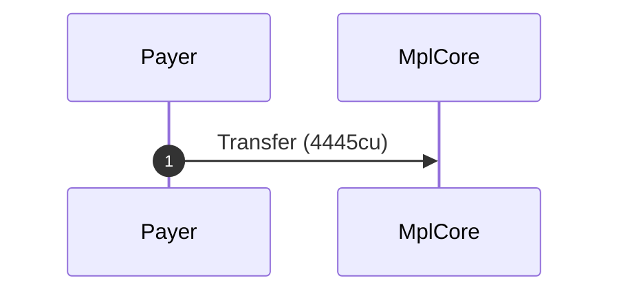
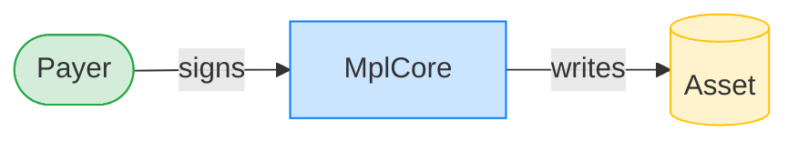
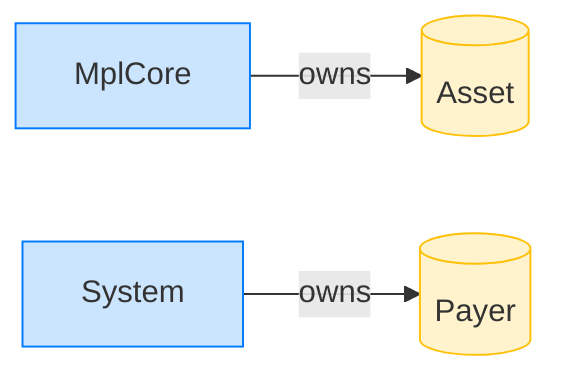

# Transfer an asset

**Intent.** Hand a valid asset to a new owner.

**Outcome.** The transaction succeeded.

**Source.** [`tests/report.rs::transfer`](../tests/report.rs#L25)

## Structured execution log

```
CPI Tree (4,445 BPF CU / 1,400,000 budget):
└── Transfer (4,445 / 1,400,000 CU) MplCore (no CPIs)
      >> log:  programs/mpl-core/src/state/asset.rs:293:Approve
```

## Sequence diagram



## Authority graph

Who signed for what; an `invoke_signed` PDA appears as its own authority.



## Ownership graph

Which program owns each account the transaction wrote.


