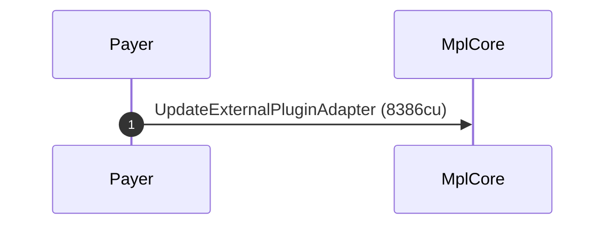
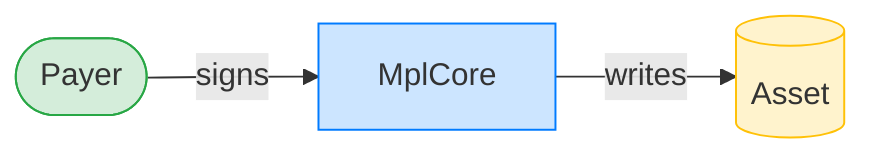
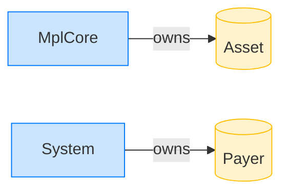

# Update an AgentIdentity plugin's lifecycle checks

**Intent.** Rewrite only the lifecycle-check flags on an asset's AgentIdentity plugin, widening them to CAN_LISTEN | CAN_APPROVE. The update authority signs; no PDA needed.

**Outcome.** The transaction succeeded.

**Source.** [`tests/agent_identity.rs::update_agent_identity_lifecycle_checks`](../tests/agent_identity.rs#L334)

## Structured execution log

```
CPI Tree (8,386 BPF CU / 1,400,000 budget):
└── UpdateExternalPluginAdapter (8,386 / 1,400,000 CU) MplCore (no CPIs)
      >> log:  programs/mpl-core/src/plugins/external_plugin_adapters.rs:381:Base:Approved
```

## Sequence diagram



## Authority graph

Who signed for what; an `invoke_signed` PDA appears as its own authority.



## Ownership graph

Which program owns each account the transaction wrote.


