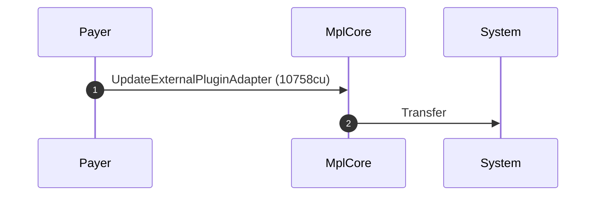
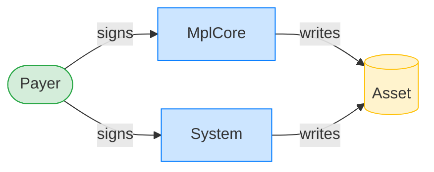
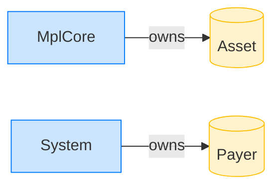

# Update an AgentIdentity plugin's URI

**Intent.** Rewrite the AgentIdentity plugin's URI on an asset that already carries it. A flat instruction: the update authority signs, no PDA needed.

**Outcome.** The transaction succeeded.

**Source.** [`tests/agent_identity.rs::update_agent_identity_uri`](../tests/agent_identity.rs#L303)

## Structured execution log

```
CPI Tree (10,758 BPF CU / 1,400,000 budget):
└── UpdateExternalPluginAdapter (10,758 / 1,400,000 CU) MplCore
    │ >> log:  programs/mpl-core/src/plugins/external_plugin_adapters.rs:381:Base:Approved
    └── Transfer System
```

## Sequence diagram



## Authority graph

Who signed for what; an `invoke_signed` PDA appears as its own authority.



## Ownership graph

Which program owns each account the transaction wrote.


