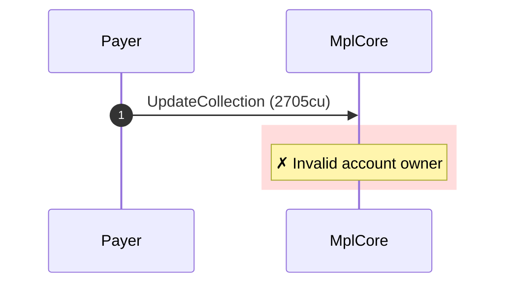
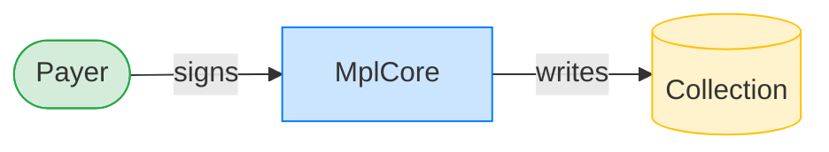
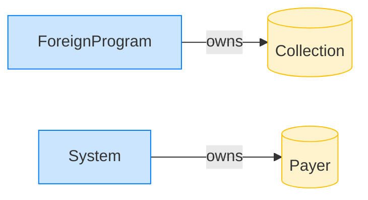

# Update-collection rejects a foreign-owned fake collection

**Intent.** A foreign-owned account with valid CollectionV1 bytes is presented to update-collection; it is rejected.

**Outcome.** The transaction failed: `Invalid account owner`.

**Source.** [`tests/account_ownership.rs::update_collection_rejects_fake_collection_owned_by_different_program`](../tests/account_ownership.rs#L186)

## Structured execution log

```
CPI Tree (2,705 BPF CU / 1,400,000 budget):
└── UpdateCollection FAILED: Invalid account owner (2,705 / 1,400,000 CU) MplCore (no CPIs)
      >> log:  Error: Invalid account owner
```

## Sequence diagram



## Authority graph

Who signed for what; an `invoke_signed` PDA appears as its own authority.



## Ownership graph

Which program owns each account the transaction wrote.


